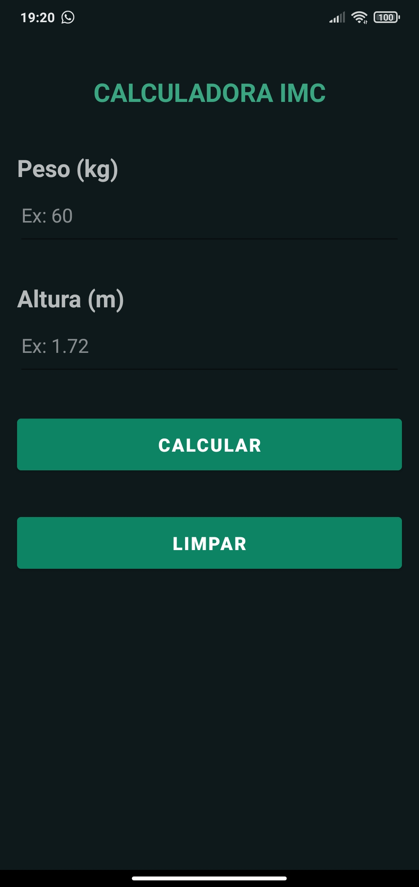
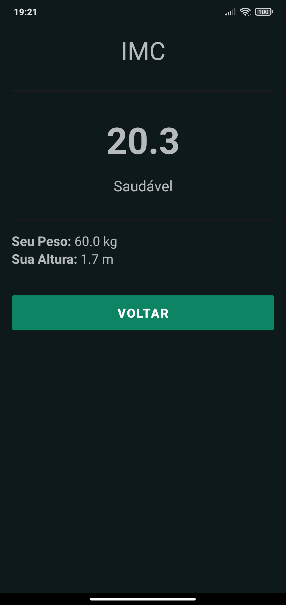
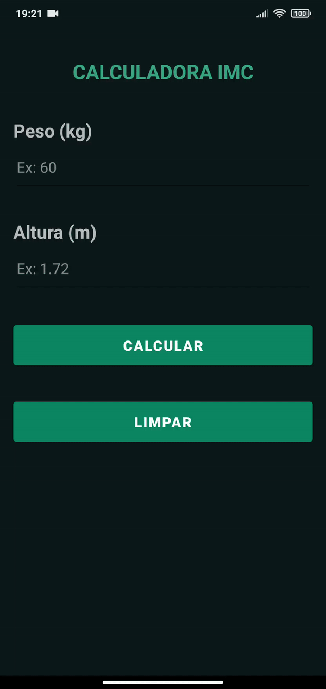

# CALCULADORA IMC - ANDROID NATIVO

Aplicativo Android Nativo que calcula o IMC (Índice de Massa Corporal) do usuário através de valores informados pelo mesmo, como o seu peso (em quilogramas) e altura (em metros).

## Demonstração(ões)

### Tela Principal

Tela que o usuário insere os valores de peso (kg) e altura (m).

### Tela Resultado

Tela que mostra o IMC, classificação e os valores inseridos anteriormente pelo usuário.

### Funcionamento

Demonstração do funcionamento da aplicação.

## Protótipos

### Protótipo da Tela Principal

Protótipo da tela principal, criada no Pencil

### Protótipo da Tela de Resultado

Protótipo da tela de resultado, criada no Pencil

## Requisitos e Regras

### 🛠 Tecnologias Utilizadas
- [Android Studio](https://developer.android.com/studio)
- [Kotlin](https://kotlinlang.org/)
- [Pencil](https://pencil.evolus.vn/)